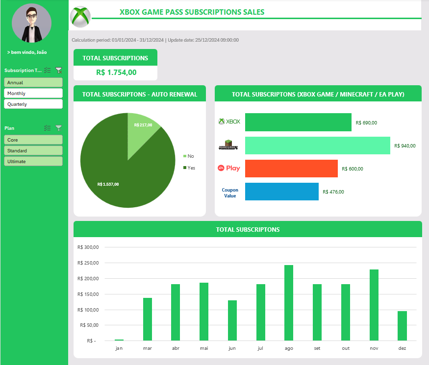

# DESAFIO DASHBOARD - VENDAS XBOX

O Projeto consiste na criação de um dashboad de vendas da Xbox.

## Base de dados

A base de dados foi coletado conforme instruções da pasta Entendendo o Desafio: Material de Apoio.

[base.xlsx](https://hermes.dio.me/files/assets/805d54f9-6d53-4246-bed7-4aa2da615923.xlsx)

## Desenvolvimento

- Segmentador do Tipo de Compra
- Segmentador do Tipo de Plano
- Card com o Total de Vendas
- Gráfico de Vendas - Renovação Automática
- Gráfico de Vendas - Divido por Produto
- Gráfico de Vendas - Divido por mês

Podemos ver as Vendas de acordo com o que for seleciona no segmentador do Tipo de Compra ou do Tipo de Plano.

## Imagem do Dashboard

