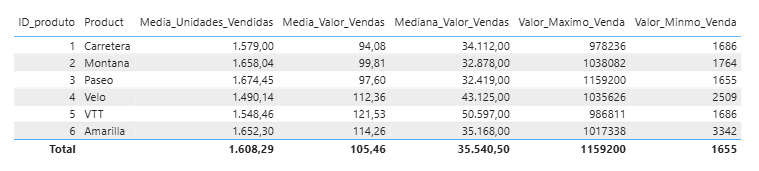
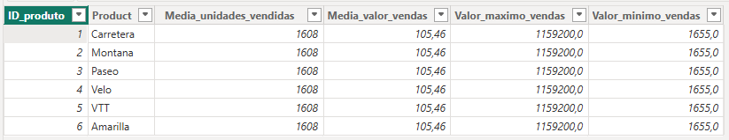
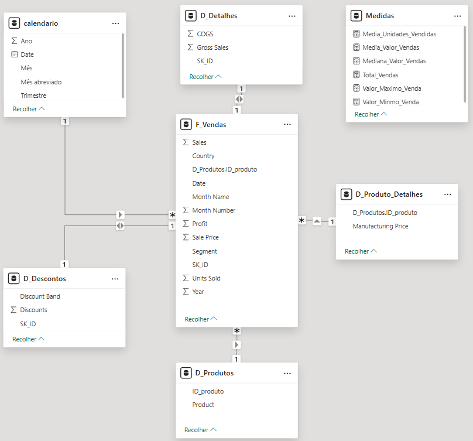

# DESAFIO  - DIO - Dashboard deE-commerce com Power BI utilizando fórmulas DAX

O Projeto consiste em criar as tabelas dimensão e fato do relatório Financial Sample baseado em star schema:
- Tabelas a serem criadas: F_Vendas, D_Produtos, D_Produtos_Detalhes, D_Descontos, D_Detalhes e calendario 

## Base de dados

A base de dados foi recuperado do Github conforme informado no desafio - Financial Sample.xlsx.

## Desenvolvimento

- Criei as tabelas como referência da tabela original.
- Verifiquei os atributos descritos para cada tabela, fato e dimensão.
    
    Criei as colunas de índice ID_Produto e SK_ID para criar as conexões da tabela fato com as tabelas dimensão.

    Excluí os atributos repetidos nas tabelas.

- Criei as medidas (DAX) para calcular corretamente os valores solicitados na tabela D_Produtos

        Media_Unidades_Vendidas = AVERAGE(F_Vendas[Units Sold])

        Media_Valor_Vendas = DIVIDE (sum(F_Vendas[ Sales]), sum(F_Vendas[Units Sold]))

        Mediana_Valor_Vendas = MEDIAN(F_Vendas[ Sales])

        Valor_Maximo_Venda = MAXX (F_Vendas, F_Vendas[ Sales])

        Valor_Minmo_Venda = MINX(F_Vendas, F_Vendas[ Sales])

    

    Criando-se uma coluna calculada na tabela, a coluna não recebe o contexto do produto e o mesmo valor é copiado para todos os produtos

    

- Star_Schema criado e a tabela de medidas

    

## Arquivos

    Os arquivos do PowerBI e da base do excel estão disponíveis na pasta arquivos, e as imagens estão disponíveis na pasta imagem.

